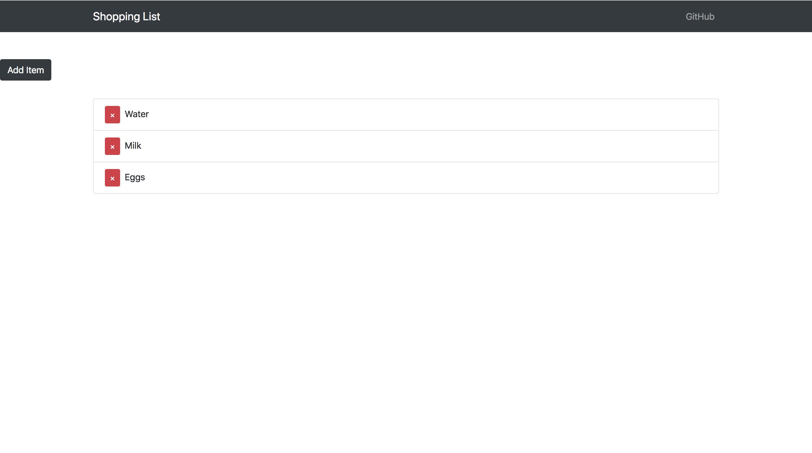

MERN stack app

Shopping List

This React/Redux based application is a simple shopping list which is connected to MongoDB through mLab and uses the Express framework on the server. 

Technologies Used: 
React.js/Redux
Node.js
Express.js
MongoDB
Axios
Mongoose
React-Strap
Heroku

Future Buildout: UserAuth, Landing Page, Additional Styling
